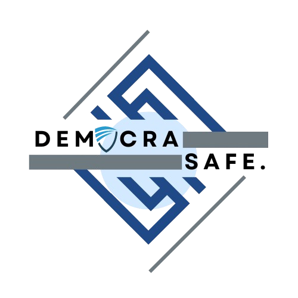

<div align="center">
  
  <h1 align="center">DemocraSafe</h1>
  <p align="center">

  <p align="center">Your vote. Secure. Private. Auditable. Powered by Zero-Knowledge Proofs

</div>

### Smart contract (contracts)

#### Step 1

Install the dependencies for your project

```bash
npm i
```

### Step 2

Compile

```bash
npm run build
```

### Step 3

Add a deploy alias to config.json

```bash
zk config
```

### Step 4 

Deploy your smart contract to the network

```bash
zk deploy devnet
```

### Front-End (ui)

Start the development server

```bash
pnpm dev
```
